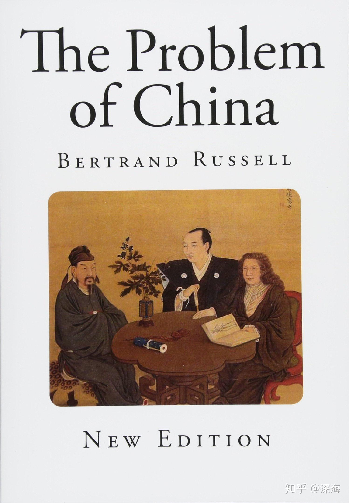
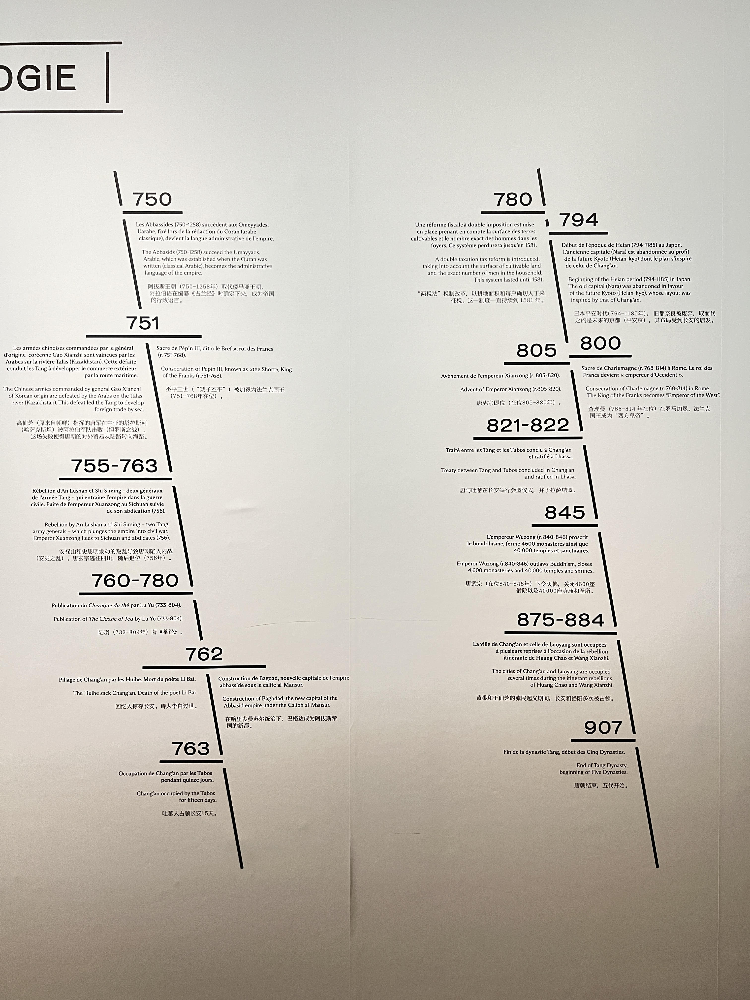

# The Problem of China！

!!! danger "“Have an idea? GitHub login → [Comment below](#comments) ⬇️ 💬😜” "

 { align=left width="50" style="border-radius: 50%; overflow: hidden;" loading=lazy}<a class="firstBlog" href='mailto:anothersky080895@gmail.com'>Molly Xue</a>

<figure markdown="span" >
  { align=left width="300" loading=lazy}
  <figcaption ><a href ='https://www.freeclassicebooks.com/Bertrand%20Russell/The%20Problem%20of%20China.pdf'>The Problem of China -- 
  <small>Bertrand Russell</small></a></figcaption>
</figure>

<!-- more -->

 When I read Mr. [Bertrand Russell]'s {== The Problem of China ==} , I often felt how little we truly understand our own country. At the same time, I was deeply impressed by Mr. Russell's profound insights into China and Asia (specifically Chinese culture) even before World War I and World War II. His writings act as a mirror, reflecting both the strengths and weaknesses of China, which we often overlook. After I moved abroad at the age of 18, I discovered the West's almost mysterious fascination with Japan. This fascination often left me bewildered because many elements, which were clearly of Chinese origin, were somehow rebranded as Japan's "advanced culture" in the Western narrative. [^1] 

We must first acknowledge Japan's undeniable success in cultural export. Even though much of this celebrated "culture" was derived from China during the Tang dynasty and earlier—a fact that can be easily verified through historical records and empirical data —it is unfortunate that few people investigate the origins beneath this surface. Or perhaps these truths have been deliberately distorted by some so-called "experts." Many are captivated by the superficial splendor of Japanese culture, driven by the consumerism crafted by capitalism. As a result, they accept the "advanced" label defined by capitalism, which is often built on a colonial logic and a fabricated sense of superiority, dismissing its deeper and more authentic historical roots in China.[^2]

From another perspective, however, China’s own shortcomings cannot be ignored. Due to various Western colonial wars, China failed to establish an early, systematic, and refined cultural export mechanism like Japan. In recent years, China’s cultural identity has seen significant growth alongside its economic strength, yet there is still considerable room for improvement.

Recently, I have become increasingly aware of the intensifying, almost mindless, admiration for Japan in Western countries. This trend reflects not only an ignorance of history but also a lack of understanding of cultural origins.

<figure markdown="span" >
  { align=left width="800" loading=lazy}
  <figcaption ><a href ='https://www.guimet.fr/fr/expositions/la-chine-des-tang'>The history timeline -- «La Chine des Tang» (618-907), Musee Guimet</a></figcaption>
</figure>

As a Westerner, Bertrand Russell was remarkably perceptive. He clearly recognized the character flaws of Europeans, such as their glorification of violence, bullying of weaker nations, and discrimination against people of color. He criticized the hypocrisy of American morality and observed that "all politics is created by grinning devils who incite the energetic and cunning to oppress the docile majority, in order to strip them of their wealth, power, and thoughts." Russell approached his critiques based on facts and remained impartial, never favoring one side over another.

It is evident that Russell held deep goodwill and admiration for the Chinese culture. Beyond his respect for Taoist philosophy, his experiences in China also left a lasting impression on him. He remarked that “the Chinese people treated me with the utmost kindness.” In his view, the Chinese are naturally tolerant, friendly, courteous, and peace-loving, pursuing freedom and possessing a wisdom that stems from thousands of years of understanding life’s ultimate truths. Yet, it was precisely these virtues—kindness, detachment, and the long-standing tradition of undervaluing technology and efficiency—that caused China to falter in the face of the West’s strong ships and sharp cannons.

In contrast, the arrogance and overconfidence of Westerners, often lead to even greater negative consequences. Russell believed that if the strengths of both cultures could be harmonized, the world would become far more joyful and peaceful than it is today.

-- Book Review *" The Problem of China "*  by Bertrand Russell 
 31/01/2025

[^1]: p107 -- 'The civilization of Japan, before the Restoration, came from China.Religion, art, writing, philosophy and ethics, everything was copied from Chinese models. Japanese history begins in the fifth century A.D., whereas Chinese history goes back to about 2,000 B.C., or at any rate to somewhere in the second millennium B.C. This was galling to Japanese pride, so an early history was invented long ago, like the theory that the Romans were descended from Æneas.'

[^2]: p121 -- 'It is true that Japanese culture, until the Restoration, was derived from China. To this day, Japanese script is practically the same as Chinese, and Buddhism, which is still the religion of the people, is of the sort derived originally from China. Loyalty and filial piety, which are the foundations of Japanese ethics, are Confucian virtues, imported along with the rest of ancient Chinese culture. But even before the irruption of European influences, China and Japan had had such different histories and national temperaments that doctrines originally similar had developed in opposite directions. China has been, since the time of the First Emperor (c. 200 B.C.), a vast unified bureaucratic land empire, having much contact with foreign nations--Annamese, Burmese, Mongols, Tibetans and even Indians. Japan, on the other hand, was an island kingdom, having practically no foreign contact except with Korea and occasionally with China, divided into clans which were constantly at war with each other, developing the virtues and vices of feudal chivalry, but totally unconcerned with economic or administrative problems on a large scale...'

[Bertrand Russell]: https://en.wikipedia.org/wiki/Bertrand_Russell

