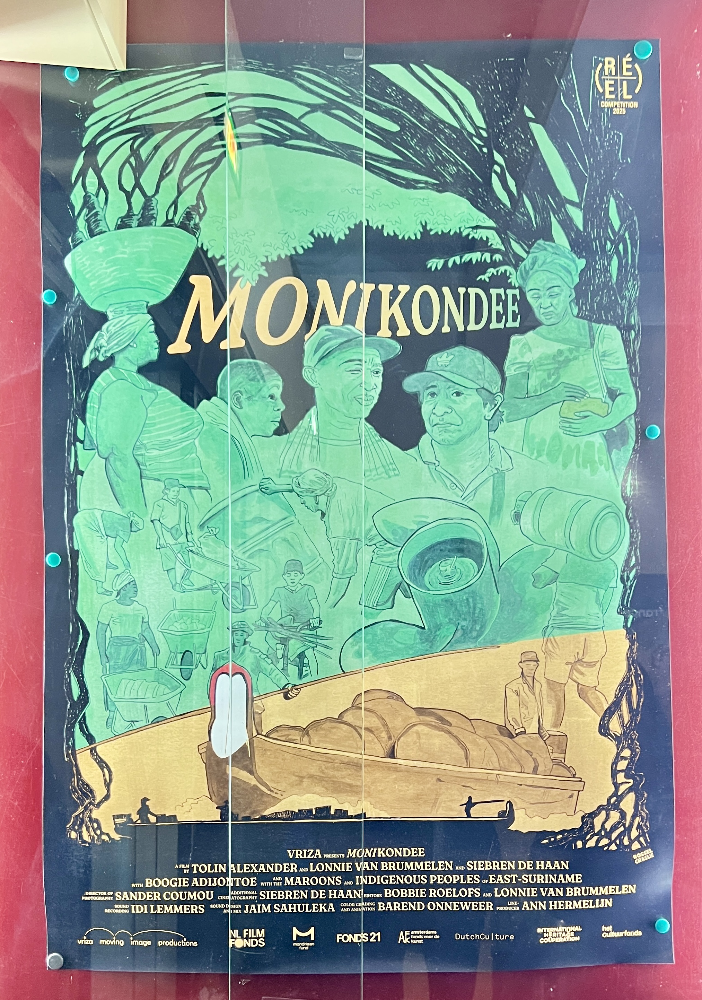

## The Film reflection

!!! danger "“Have an idea? GitHub login → comment below ⬇️ 💬😜” "

 { align=left width="50" style="border-radius: 50%; overflow: hidden;" loading=lazy}<a class="firstBlog" href='mailto:anothersky080895@gmail.com'>Molly Xue</a>

<figure markdown="span" >
  { align=left width="300" loading=lazy}
  <figcaption ><a href ='https://www.imdb.com/title/tt36242352/mediaviewer/rm1627426306/?ref_=tt_ph_more'>Monikondee  
  <small>-- Lonnie van Brummelen, Siebren de Haan & Tolin Erwin </small></a></figcaption>
</figure>

<!-- more -->

Tonight i watched an excellent documentary{== Monikondee（money land） ==}，which tells story about：

“For centuries, the Maroons in Suriname have kept capitalist society at bay. Descendants of enslaved Africans who escaped plantations, they survived by adhering to ancestral values. In recent years, however, economic interests have penetrated deep into the rainforest.

Boatman Boogie navigates the Maroni River, which forms the border between Suriname and French Guiana, to deliver essential cargo to remote Maroon and Indigenous communities. While these forest peoples grow their own food, they are increasingly dependent on boatmen for their daily provisions. Climate-driven flooding and droughts are destroying their crops, and gold mining is poisoning the water.

When Boogie is summoned by his clan leaders to attend his nephew’s trial, the demands of his work begin to conflict with his traditional duties. During a winding journey far upstream, the currents grow increasingly unpredictable.
The multi-voiced narrative of this hybrid, participatory documentary draws inspiration from the mato, a collective Maroon storytelling technique in which the teller is interrupted by others who add their own stories and songs.“[^1] 

After watching the entire film, I felt elated and enlightened. The film portrays the Indigenous tribes’ rich and colorful culture and attire, reflecting a free and vibrant way of life. Their barter system and rejection of money align with the insights of David Graeber in Debt: [The First 5000 Years],[^2] which, through extensive anthropological research, argues that early societies primarily relied on credit and debt rather than direct barter. Hence, the origins of money are more closely tied to debt relationships than to a mere tool for market transactions. Money is not just an economic instrument --- it profoundly impacts human relationships. In modern capitalist societies, money simplifies complex social obligations such as kinship, friendship, and responsibility into “repayable debts,” thereby altering social structures and interpersonal relationships.

In ancient times, people created value through labor and exchanged it for necessities, forming the foundation of a sustainable community. However, when white capitalists arrived and discovered gold mines, they plundered resources without restraint, polluted the local environment, and exploited both natural resources and labor for selfish gains. They distorted historical truths, labeling Maroon tribes as inferior and uncivilized, while justifying their violent conquests under the banner of “Western civilization”—a ridiculous and baseless claim. These colonialists introduced the so-called “monetary economy,” which fostered competition, disrupted the tribes' ecological balance, and even negatively influenced the younger generation through a deeply flawed education system. Archaeological evidence aligns with David Graeber’s insights in [The Dawn of Everything], where he notes:

???+ Quote

    ^^"The word 'democracy' might have been invented in Europe (barely, since Greece at the time was much closer culturally to North Africa and the Middle East than it was to, say, England), but it's almost impossible to find a single European author before the 19th century who suggested it would be anything other than a terrible form of governement"^^, 

    “There’s a reason why, in English, the words ‘politics,’ ‘polite,’ and ‘police’ all sound the same—they are all derived from the Greek word polis, or city, the Latin equivalent of which is civitas, which also gives us ‘civility,’ ‘civic,’ and a certain modern understanding of ‘civilization.’ ”[^3] Humanity has been misled by such misconceptions for centuries.

The film adopts a first-person narrative perspective, maintaining a singular protagonist rather than switching between narrators, offering viewers an intimate look into the lives of boatmen from the Pamaka, Aluku, and Ndyuka tribes. From dawn to dusk, from the Amazon rainforest to turbulent rivers, their lives are arduous yet filled with beautiful, natural melodies echoing through the waters, boats, and their resilient bodies. These songs convey their grievances against intruders, their nostalgia for their ancestral way of life, and their deep commitment to preserving their communities and fostering genuine human connections. This is true civilization which is enduring, ever-evolving, and a truth that humanity should steadfastly uphold and pursue.

Moreover, the film features a cyclical narrative structure, transitioning from nature to urban life at the beginning, and returning from the city to nature at the end. The director’s creative approach uses a map to trace the protagonist’s daily boat routes, weaving together a mesmerizing portrait of this ancient South American land. The result is a visually stunning tapestry, a profound poem, and a timeless legend of tribal resilience. Such beauty deserves preservation, requiring collective human wisdom, understanding, and effort

-- Brief Film Review *" Monikondee "* ,  
   Cinéma Saint-André des Arts, Paris,  
   29/03/2025

[^1]: Cinéma du réel -- https://www.cinemadureel.org/en/films/monikondee/

[^2]: David Graeber -- Debt: The First 5,000 Years

[^3]: David Graeber -- The dawn of everything, p17 and p5

[The First 5000 Years]:https://en.wikipedia.org/wiki/Debt:_The_First_5,000_Years

[The Dawn of Everything]: https://en.wikipedia.org/wiki/The_Dawn_of_Everything