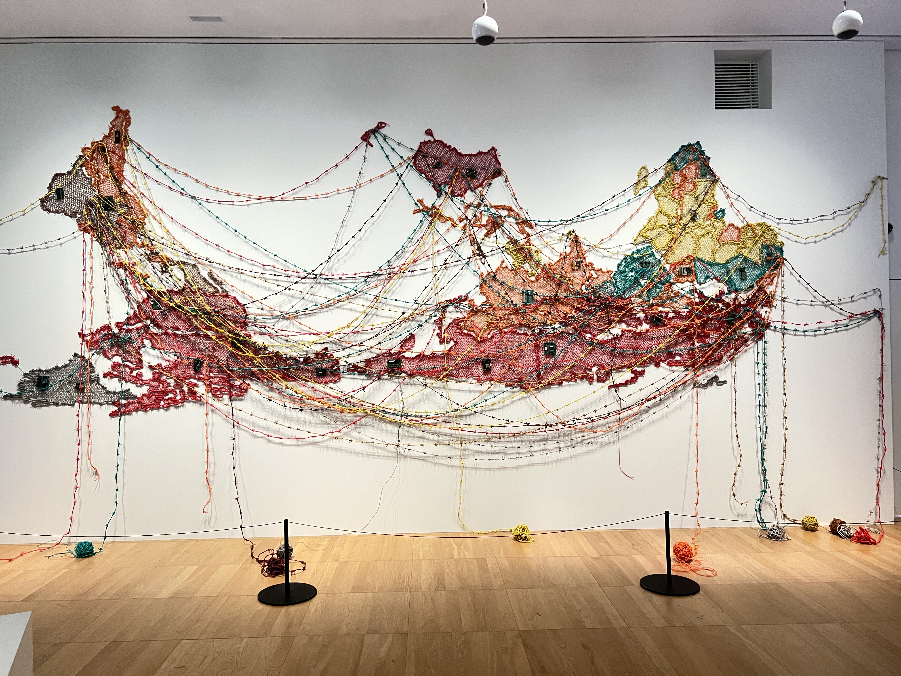

## The Migration 

 { align=left width="50" style="border-radius: 50%; overflow: hidden;" loading=lazy}<a class="firstBlog" href='mailto:anothersky080895@gmail.com'>Molly Xue</a>

<figure markdown="span" >
  { align=left width="800" loading=lazy}
  <figcaption ><a href ='https://reenakallat.com/woven-chronicle-2018/'> Woven Chronicle 
  <small>-- Reena Saini Kallat (live and work in India)</small></a></figcaption>
</figure>

<!-- more -->

I saw an excellent exposition 'Migration' in Musée de l'homme：

Article Coming Soon...

--- The Migration 
  >  Musée de l'homme, Paris, 
    09/04/2025

[^1]: 
The Migration, Musée de l'homme -- https://www.museedelhomme.fr/fr/exposition-evenement/migrations-une-odyssee-humaine

