## Small poetry of trip to UK 🇬🇧

 { align=left width="50" style="border-radius: 50%; overflow: hidden;" loading=lazy}<a class="firstBlog" href='mailto:anothersky080895@gmail.com'>Molly Xue</a>

<!-- more -->

-   Songs drift from the Scottish Highlands,

    <!--  <figcaption> <small>Edinburgh scoltland highland</small> </figcaption> -->

    echoes of the Viking age,

    while Edinburgh, draped in gray, 

    is brightened ☀️ by the colors of the Fringe.

    Who shattered the peace

    of the ancient Indian Empire 🇮🇳?!

    Kanpur, 1857— splendent civilization turned to ash.

-   

    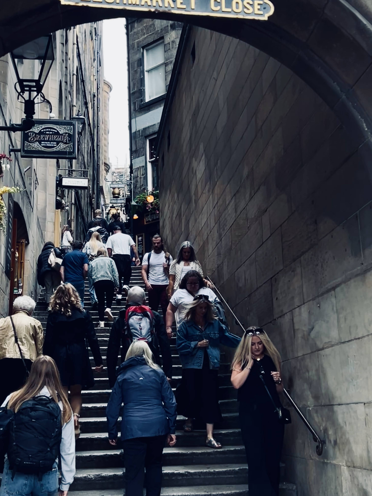{: align=right width="250" loading=lazy}
    /// caption
    ///

-   
    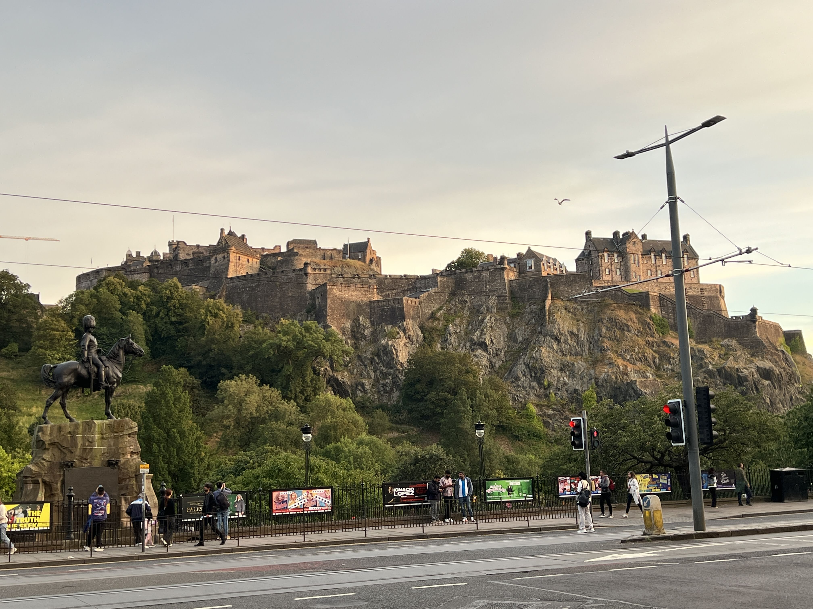{ align=right width=350 }
    /// caption
    Edinburgh castle
    ///

-   And in 1984, Orwell warned: 
    <!-- [Placeholder](./../../assets/ukTripBlog/Kanpur1.JPG){: align=right width="300" loading=lazy} -->

    *War is peace,
    freedom is slavery,
    ignorance is strength.*

    Big Brother whispered:
    dictatorship is the madness of humankind.
<!-- <figure style="float: left; margin-right: 500px; width: 500px;">
  
  <figcaption><small>Edinburgh castle</small></figcaption>
</figure> -->

<!--    -->
<video width="500" height="400" controls>
  <source src="./../../assets/ukTripBlog/north_sea.mp4" type="video/mp4">
  Your browser does not support the video tag.
</video>

-   The North Sea, serene and blue, 

    sings its grave, eternal hymn beneath the sun.

    Newcastle, Durham, York slowly draw the silouette in the wind.

    In the year 71, Constantine’s Rome raised its walls in Yorkshire.

    By 866, Vikings claimed the land.

-   

    { width=350 }
    /// caption
    The Sambles, York
    ///

    <!-- {: align=right width="250" loading=lazy} -->
    <!-- <small style="float: right; margin-left: 600px; font-size: x-small;">The Sambles, York</small> -->

-   

    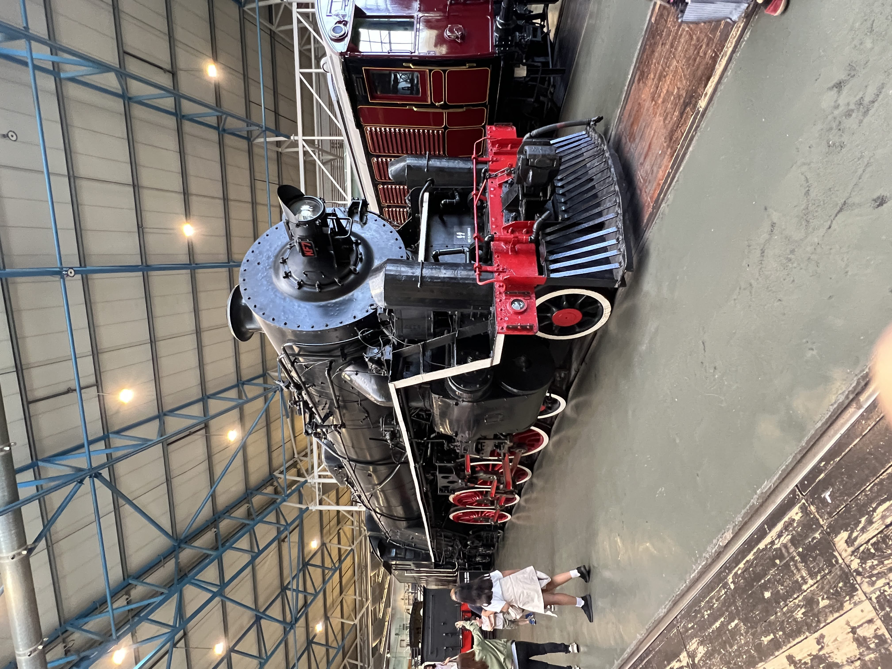{ width="350" loading=lazy}
    /// caption
    The Railway museum, York
    ///

    <!-- <small style="float: right; margin-left: 600px; font-size: x-small;">The Railway museum, York</small> -->

-   A century later, Anglo-Saxons marveled at its might.

    Medieval streets, timbered houses leaning with time,

    stained glass gleaming with colored light—

    a weaving of cultures across centuries.

-   Suddenly, 

    the gates of the world’s industry opened with steam.

    Manchester,

    city of labor, wisdom, and invention.

    Here, *Baby*, the first stored-program computer, [^1]

    breathed life into the digital age.

-  

    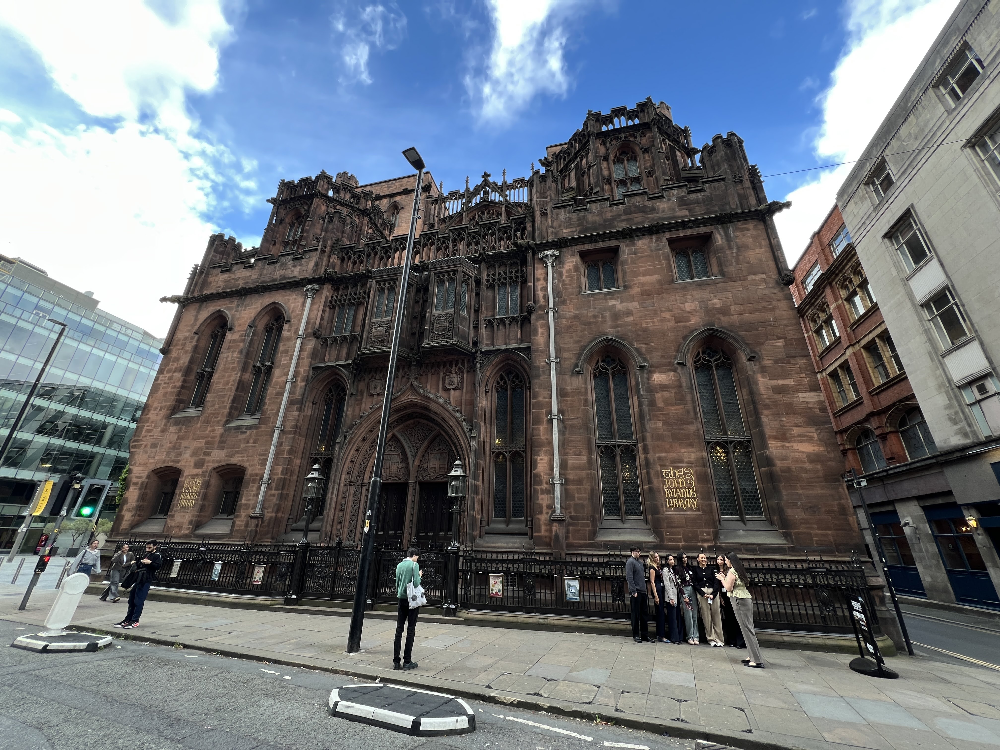{: align=right width="350" loading=lazy}
    /// caption
    Reynold library, Manchester
    ///
    <!-- <small style="float: right; margin-left: 600px; font-size: x-small;">Reynold library, Manchester</small> -->

-   Radical, restless, aflame with revolution,

    she cradled politics,

    incubated art,

    married the ancient to the modern,

    and dreamed of endless possibilities.

-   

    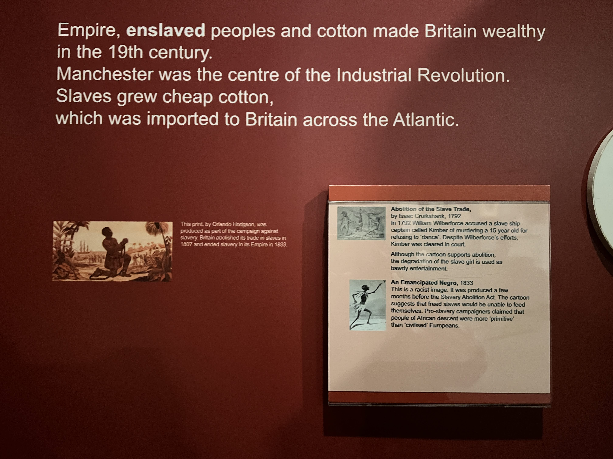{: align=right width="350" loading=lazy}
    /// caption
    People’s History Museum, Manchester
    ///
    <!-- <small style="float: right; margin-left: 600px; font-size: x-small;">People’s History Museum, Manchester</small> -->

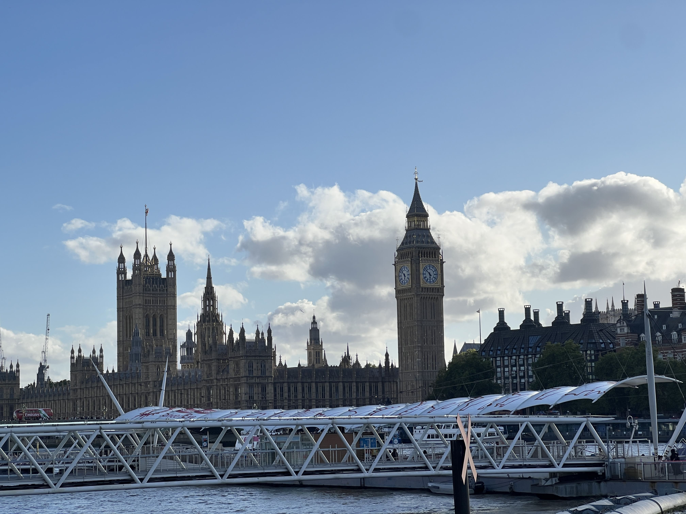{ width="460" loading=lazy}
/// caption
Big Ben, London
///

<!-- <figure style="float: left; margin-right: 500px; width: 500px;">
  
  <figcaption><small>Big Ben, London</small></figcaption>
</figure>
  -->
The Victorian sun never set on the empire.

Wealth and trade flowed down the Thames,

lifting London into the heart of the world.

Among cold steel and concrete,

warmth is found in the diverse, bustling markets,

Notting Hill, Chinatown…

In the great encyclopedia of the [British Museum],

two million years, eight million treasures,

nourishes this land and the souls of its people.

Old and new entwine:

a power station reborn as Tate Modern,

the [Natural History Museum]

recreated the Jurassic and Ancient Chronicles of the earth.

Here poets lingered,

legends were penned,

scientists were nurtured,

who created colorful miracles for humankind.

Once the empire of empires,

scarred by the smoke of industry,

laden with capital and reluctant to change.

Yet in such cold, damp rainy days,

where to console the wet body?

bookshops, tea, and carrot cake

seem to offer a brief moment to breathe,

a pause, a chance to dream.

--- Molly, 
>   Brief Summary of This Post-industrial Capital *" United Kingdom "* , 
    09/09/2025

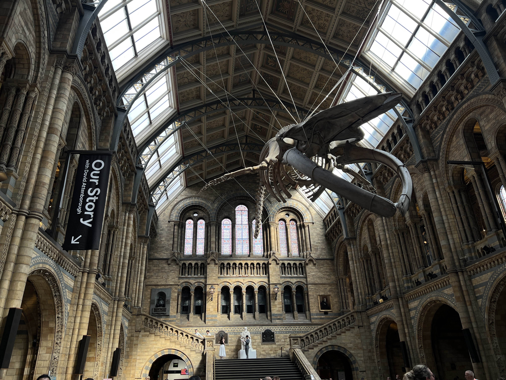{ width=500 }
/// caption
Natural History Museum, London
///

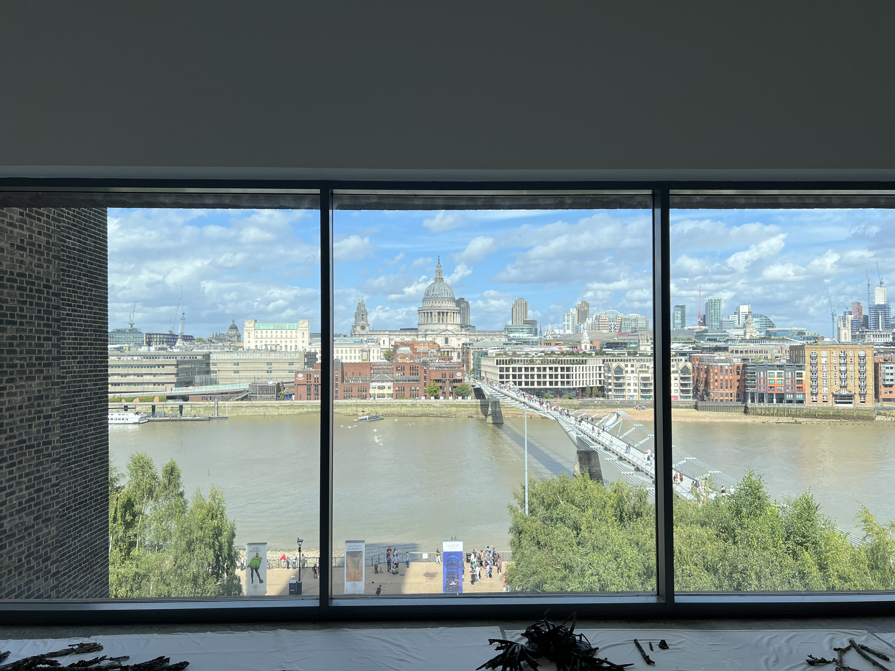{ width=500 }
/// caption
Tate Mordern View Cross Thames, London
///

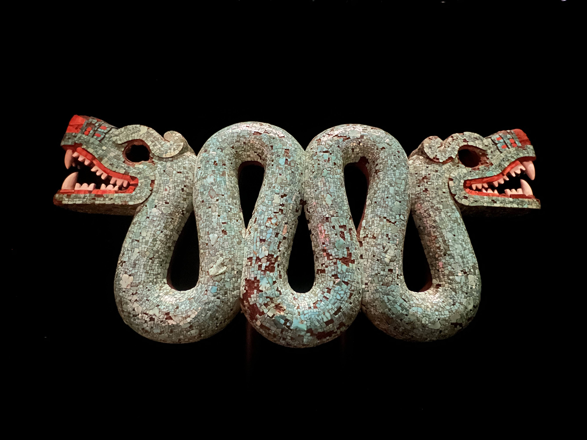{width=500}
/// caption
British Museum, Mexico Aztez mosaic mask, AD 1400-1621, London
///

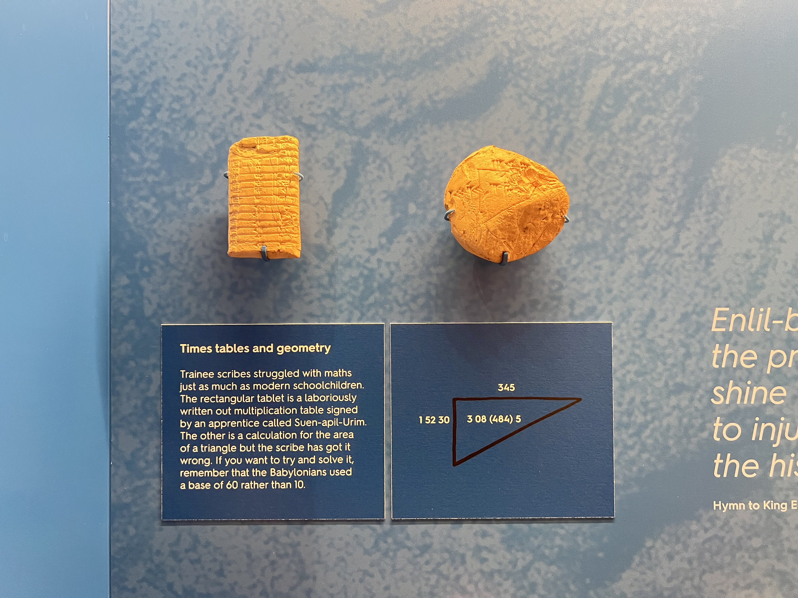{width=500}
/// caption
Times tables and Geometry inscriptions, Babylon, 1900-1600 BCE, Ashmolean Museum, Oxford
///

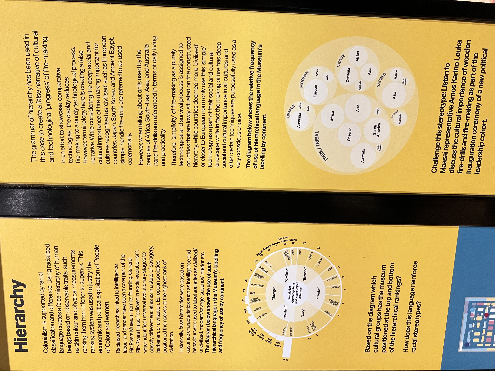{width=500}
/// caption
False Historical Narrative Hierarchy Explanation, Pitt River Museum, Oxford
///

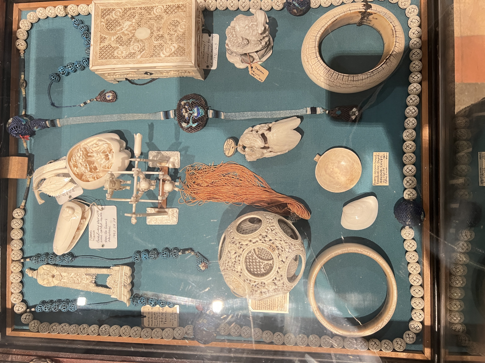{width=500}
/// caption
Ivory carving crafts found in China(1827) and Egypt, Pitt River Museum, Oxford
///

<!-- <figure style="float: left; margin-right: 500px; width: 500px;">
  
  <figcaption><small>Natural History Museum, London</small></figcaption>
</figure>
<figure style="float: left; margin-right: 500px; width: 500px;">
  
  <figcaption><small>Tate Mordern View Cross Thames, London</small></figcaption>
</figure> -->
<!-- <figure style="float: left; margin-right: 500px; width: 500px;">
  
  <figcaption><small>British Museum, Mexico Aztez mosaic mask, AD 1400-1621, London</small></figcaption>
</figure>
<figure style="float: left; margin-right: 500px; width: 500px;">
  
  <figcaption><small>Times tables and Geometry inscriptions, Crete, 1900-1600 BCE, Ashmolean Museum, Oxford</small></figcaption>
</figure>
<figure style="float: left; margin-right: 500px; width: 500px;">
  
  <figcaption><small>False Historical Narrative Hierarchy Explanation, Pitt River Museum, Oxford</small></figcaption>
</figure>
<figure style="float: left; margin-right: 500px; width: 500px;">
  
  <figcaption><small>Ivory carving crafts found in China(1827) and Egypt, Pitt River Museum, Oxford</small></figcaption>
</figure>
  -->

 [^1]:
    { width=500 }
    /// caption
    he Manchester Baby, also called the Small-Scale Experimental Machine (SSEM), was the first electronic stored-program computer. It was built at the University of Manchester by Frederic C. Williams, Tom Kilburn, and Geoff Tootill, and ran its first program on 21 June 1948.
    ///
 <!-- <figure style="float: left; margin-right: 500px; width: 500px;">
  
  <figcaption><small>The Manchester Baby, also called the Small-Scale Experimental Machine (SSEM), was the first electronic stored-program computer. It was built at the University of Manchester by Frederic C. Williams, Tom Kilburn, and Geoff Tootill, and ran its first program on 21 June 1948.</small></figcaption>
</figure> -->
 
[British Museum]: https://www.britishmuseum.org/
[Natural History Museum]: https://www.nhm.ac.uk/