## Voyage à Valencia 🥘 

!!! danger "“Have an idea? GitHub login → comment below ⬇️ 💬😜” "

 { align=left width="50" style="border-radius: 50%; overflow: hidden;" loading=lazy}<a class="firstBlog" href='mailto:anothersky080895@gmail.com'>Molly Xue</a>

<!-- more -->

-   🌍 Reading the City of Valencia

    When I travel to a new place, I’m always drawn first to its local bookshops and museums. They tell me more about a city’s soul— 
    how much care it invests in creativity, how open it is to the world, what it truly values, and the depth of its collective mindset. 🌻

    With creativity as our compass, practice as our ritual, and collaboration as our bond, we resist forgetting. 
    
    -- inspired from Valencia

-   Great presentation and reflections of Museu Valencia d'Etnologia(L'ETNO) made me think of the People’s History Museum in Manchester, UK
    
    — another outstanding ethnographic museum that tells human history in a radical, vivid and deeply reflective way. 
    
    Both places show how great museums and exhibitions should do more than display objects: they should educate and inspire, 
    
    using interaction and storytelling to connect history with lived experience.

-   

    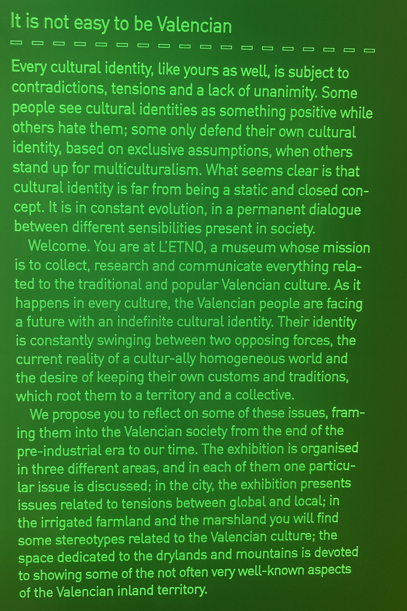{: align=left width="350" loading=lazy}
    /// caption 
    Museu Valencià d'Etnologia (L’ETNO)
    ///

-   
    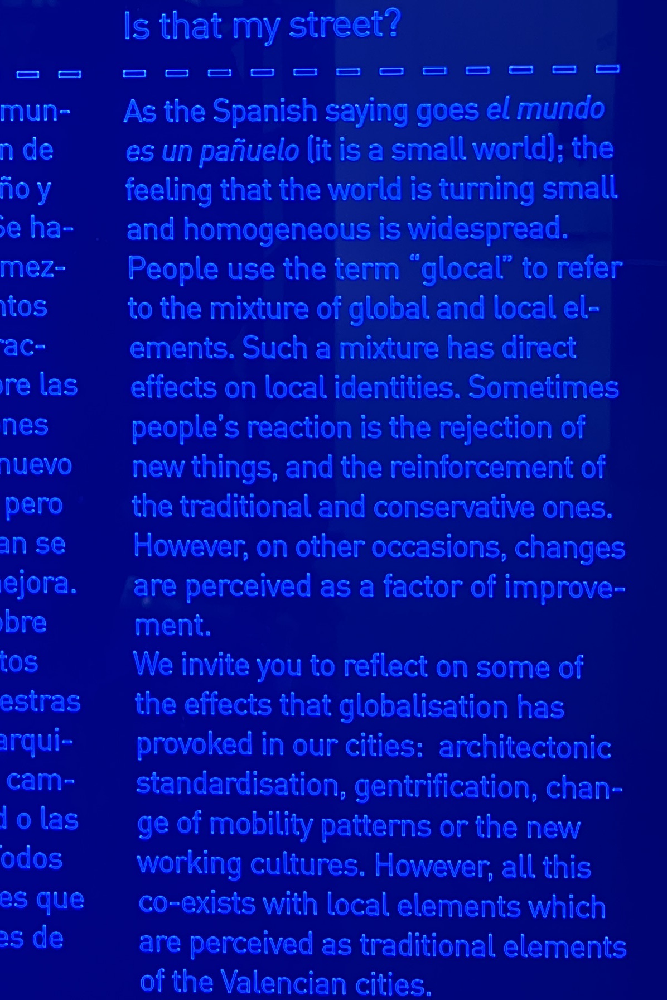{ align=left width=350 }
    /// caption
    L’ETNO
    ///
-   
    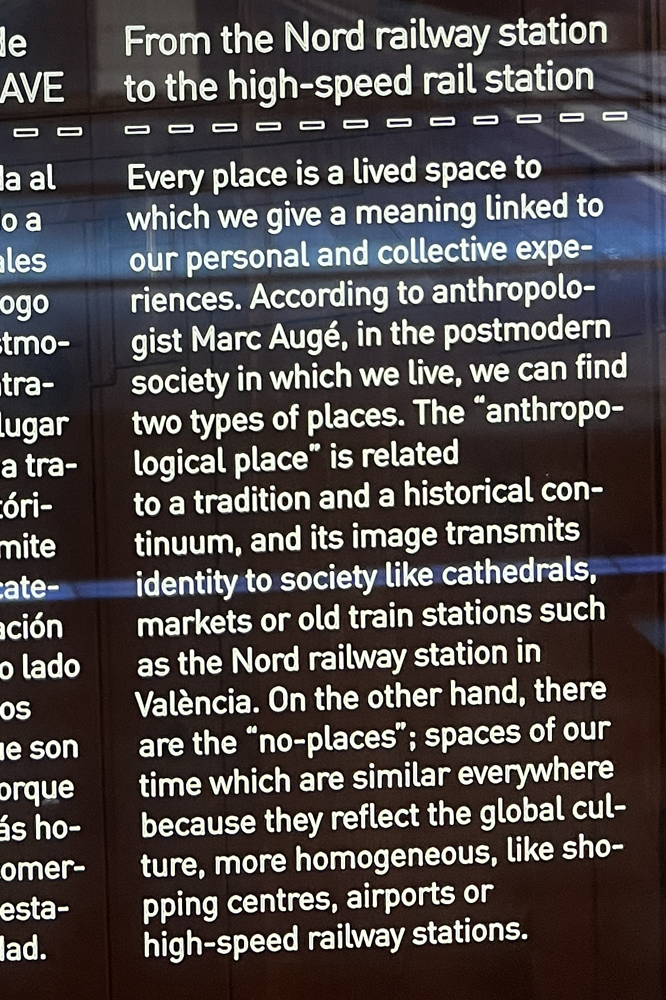{ align=right width=350 }
    /// caption
    L’ETNO
    ///

-   
    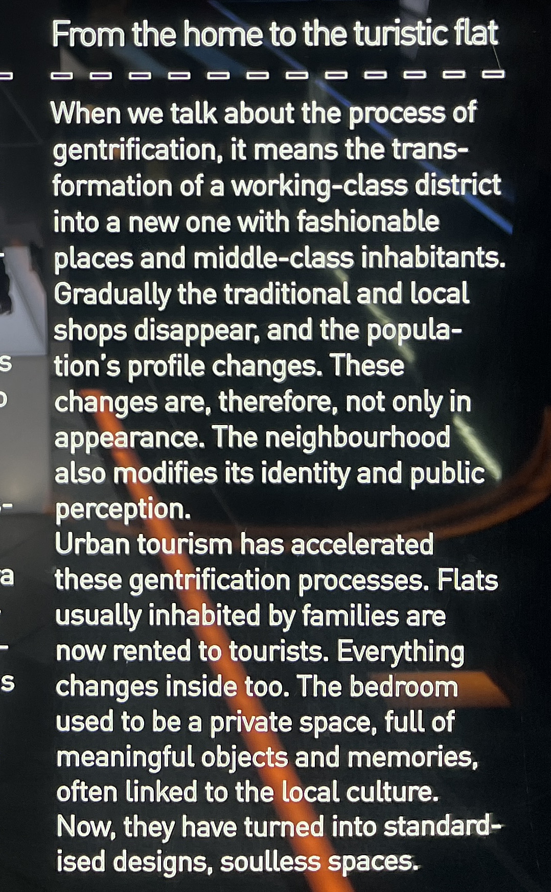{ align=left width=300 }
    /// caption
    L’ETNO
    ///
-   
    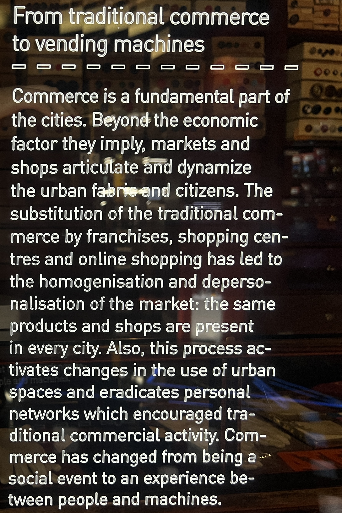{ align=right width=350 }
    /// caption
    L’ETNO
    ///

-   
    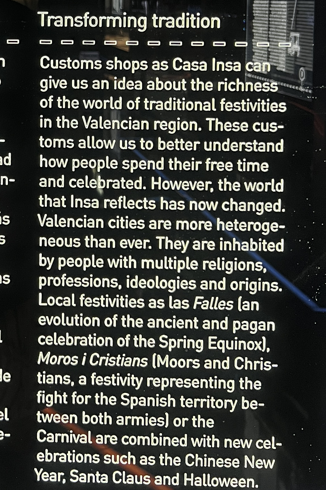{ align=left width=350 }
    /// caption
    L’ETNO
    ///
-   
    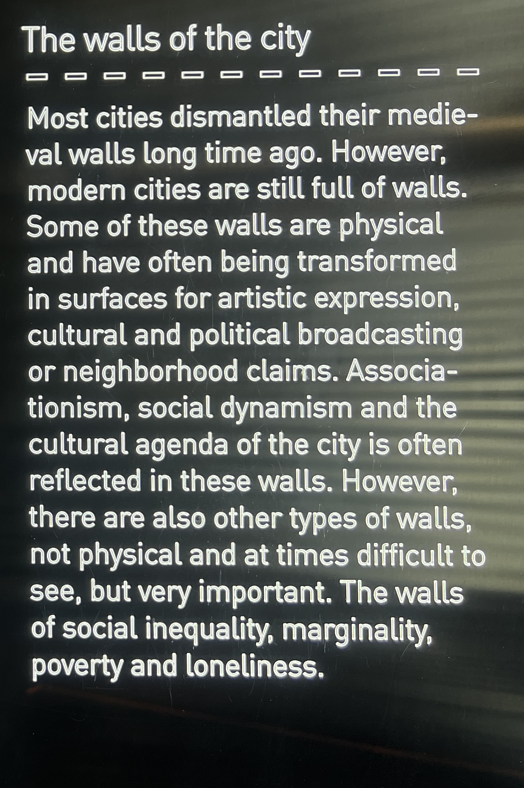{ align=right width=350  }
    /// caption
    L’ETNO
    ///

- As you wander through Valencia, traces of its Moorish intelligence reveals everywhere—from ornate architectural details to rich colors and unforgettable flavors. For a deeper look into this captivating influence, I highly recommend [Jason Webster’s video on Moorish Valencia](https://www.youtube.com/watch?v=CX5vD2cates). 

-   
    { align=left width=350 }
    /// caption
    Museu Valencià d'Etnologia Islamic Style Courtyard
    ///
-   
    { align=right width=350 }
    /// caption
    Museu Valencià d'Etnologia Islamic Style Caféteria
    ///

-   
    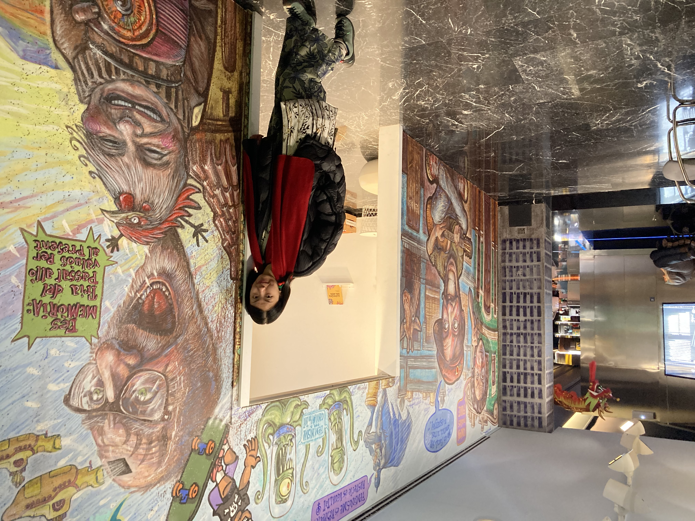{ align=left width=350 }
    /// caption
    A Manga wall with black humour, Museu Valencià d'Etnologia 
    ///

-   

    { align=right width=350 }
    /// caption
    Todos Contentos Y Yo También (Everyone's happy, and so am I.)
    ///

<figure markdown="span" >
  { align=left width="800" loading=lazy}
  <figcaption ><a href ='https://www.youtube.com/watch?v=OJsWSa_On9A'>
  Librería Bartleby, Russafa, Valencia </a></figcaption>
</figure>

-   📚 Librería Bartleby, Russafa, 11/12/25

    At Librería Bartleby in Russafa, I discovered one of the most intellectually stimulating bookstores I’ve visited in a long time. The shelves are filled with comics from artists all over the world—each book visually striking, each one with a distinct artistic language. Many are translated from English into Spanish, alongside carefully curated contemporary and modern works.

    What struck me most was how rare this kind of bookstore feels. For instance in Paris, It’s uncommon there to find spaces so willing to translate and introduce challenging, foreign-language works into French for a wider audience. That willingness to share ideas across languages says a lot about a city’s intellectual openness and depth. In Valencia, I felt a genuine curiosity about the world, a confidence in engaging with complexity rather than retreating into cultural conservatism. It felt like a city looking forward—rooted in its local identity while continuously reinventing itself.

    Inside the store, we found a beautifully illustrated map inspired by [Virginia Woolf’s](https://en.wikipedia.org/wiki/Virginia_Woolf) 1923 writings about London, reimagined through drawings that reconstruct the city as it once was. 

    <figure markdown="span" >
      { align=left width="500" loading=lazy}
      <figcaption ><a href ='https://www.zinnedproject.org/news/erasing-history/'>Virginia Woolf's London's map in 1923s </a></figcaption>
    </figure>
    
    We also came across a powerful and unexpected find: Erasing History: How Fascists Rewrite the Past to Control the Future by Jason Stanley, Professor of Philosophy at Yale University. I was genuinely impressed by their intelligence and careful selection — whereas in Paris the most liked books are pure french nationalist 😅.

    <figure markdown="span" >
      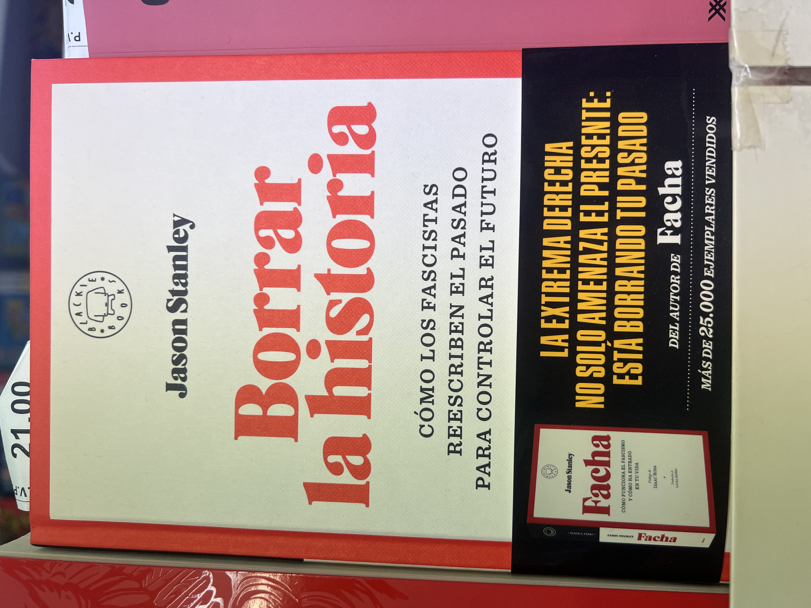{ align=left width="500" loading=lazy}
      <figcaption ><a href ='https://www.zinnedproject.org/news/erasing-history/'>Erasing History: How Fascists Rewrite the Past to Control the Future, Jason Stanley</a></figcaption>
    </figure>
    

    [Stanley’s book](https://www.zinnedproject.org/news/erasing-history/) exposes how authoritarian regimes manipulate historical narratives to maintain power, often by weaponizing education. One of his central arguments is that fascism does not belong to the past. As he writes, “Fascism is not a historical artifact, but a reoccurring political logic, one that depends on mythologizing a lost past, stoking a sense of victimhood, and building a hierarchy of purity.”

    He explains how fascist systems begin by erasing histories of colonization and oppression, rewriting educational materials to convince people that they have no past. This logic is already present throughout *Hitler’s Mein Kampf*, particularly in what later became known as the “Great Replacement” theory: the idea that Marxists, leftists, and Jewish global elites are conspiring to destroy a supposedly pure national identity. 

    Stanley also shows how fascist education deliberately narrows historical perspectives. By excluding multicultural and multiracial narratives, it becomes incompatible with democracy and equality—and dangerously capable of producing mass violence. He references thinkers like [W. E. B.] du Bois, who pointed out the contradiction of Europe seeing itself as the highest of all civilization while repeatedly unleashing horrific wars. In fascist textbooks, the nation is always portrayed as the greatest on earth, its founders as flawless heroes, its flag as sacred — leaving no room for critical thought or historical nuance. 🤐

    What makes this book especially compelling is that it does not stop at diagnosis. Stanley proposes concrete forms of resistance: creating global reading clubs, educating ourselves collectively, staying conscious of historical context, exchanging ideas across borders, and organizing events together to resist dictatorship. Knowledge, for him, is not passive — it is a shared, political act. 💭

    Finding a book like this 💮, in a small independent bookstore in Valencia, felt meaningful. It reminded me that the spaces we create for reading, thinking, and translating ideas matter — and that cities reveal their values not just through architecture or food, but through the books they choose to place on their shelves.
   

### 💒 Carme Contemporary Culture Centre (CCCC) 

-   

    { align=left width=350 }
    /// caption
    Carme Contemporary Culture Centre (CCCC) courtyard,Valencia
    ///

-   

    { align=right width=350 }
    /// caption
    CCCC islamic style courtyard view
    ///

-   

    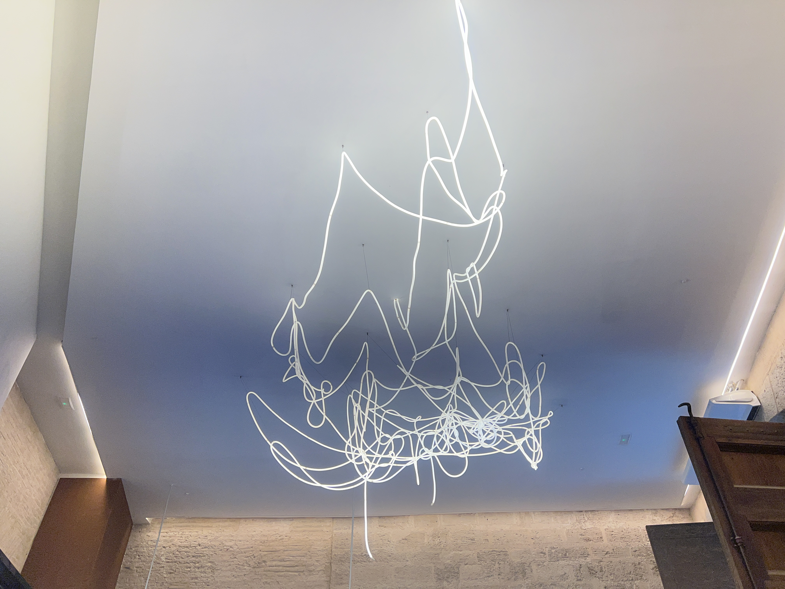{ width="350" loading=lazy}
    /// caption
    CCCC entrance abstract lamp, Valencia
    ///

-   

    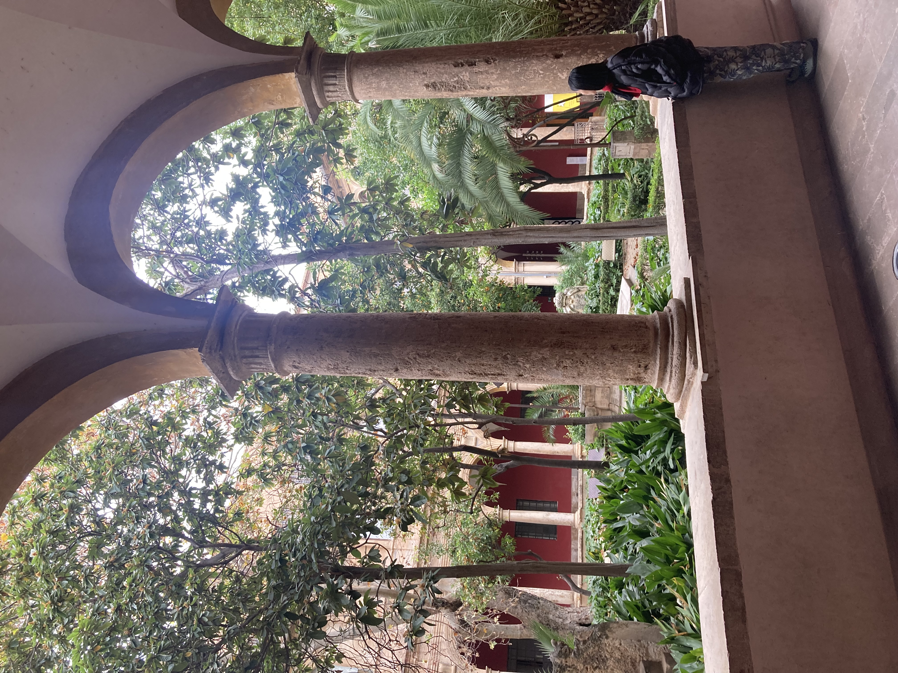{ width="350" loading=lazy}
    /// caption
    Attracted by CCCC's islamic style courtyard
    ///

-   

    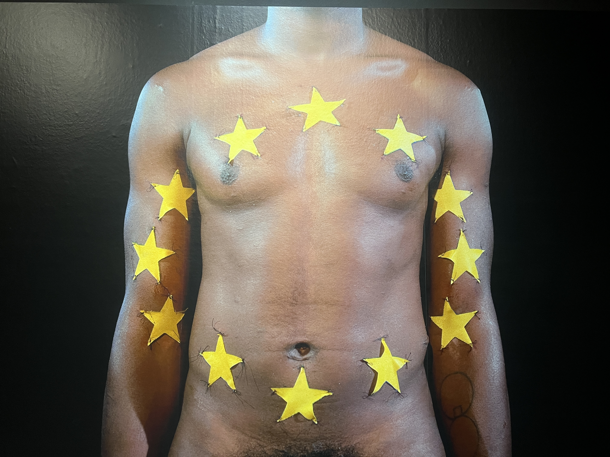{ width="350" loading=lazy}
    /// caption
    Maze, Carlos Martiel, CCCC, Valencia
    ///

-   

    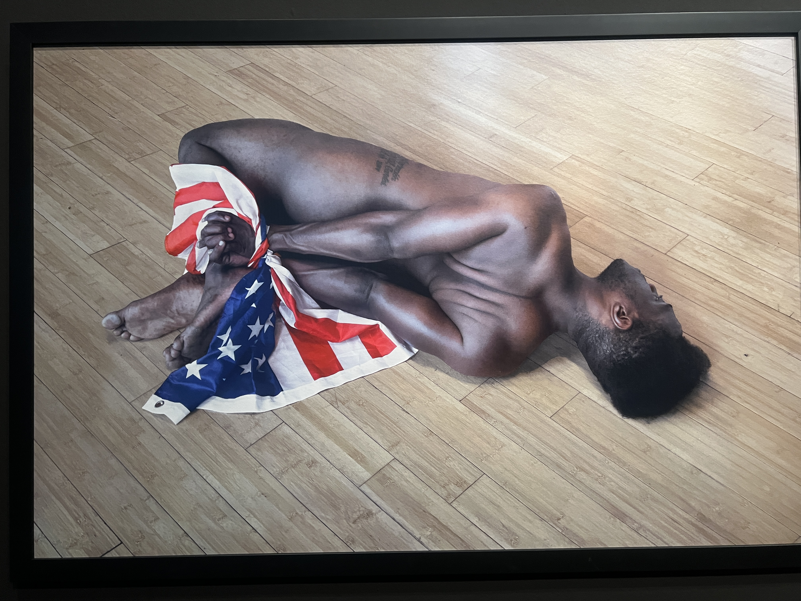{ width="350" loading=lazy}
    /// caption
    Maze, Carlos Martiel, CCCC, Valencia
    ///

???+ Carlos Martiel
    [Carlos Martiel](http://www.carlosmartiel.net/biography/) (born in 1989 in Havana) lives and works in New York.

    Carlos Martiel's new performance Maze reflected on the current system of mass incarceration and racial discrimination in the United States, where a disproportionate number of the imprisoned are African Americans and Latino immigrants. Focusing on forced labor within the prison system, and the threat of loss of privileges and solitary confinement for prisoners who refuse to work, Martiel took a position of stillness and drew parallels between current prison policies and conditions in the US and historical systems of oppression in Europe.

#### 🖌️ Transformation of El Cabanyal

-   

    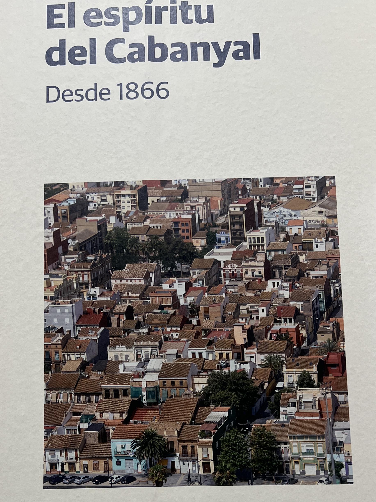{ width="350" loading=lazy}
    /// caption
    CCCC El Cabanyal in 1866, Valencia
    ///
   

-   

    In 1821, El Cabanyal, El Canyamelar, and El Cap de França were independent settlements. Later, in 1837, a merger granted them full autonomy, and they became known as Poble Nou de la Mar. However, their independence ended in 1897 when the town was finally absorbed by Valencia.

    At the end of the 19th century, the European bourgeoisie's taste for Modernism left its distinctive mark on El Cabanyal. While neighborhoods like El Grau, l'Eixample, and Ciutat Vella erected ostentatious Modernist buildings, the humble families of El Cabanyal decorated their houses with colorful tiles, creating their own interpretation of the style through the fashionable ornamental elements.

-   

    { width="350" loading=lazy}
    /// caption
    Mordern Fish Distinct -- El Cabanyal poster design, CCCC, Valencia
    ///

-   
    
    In addition to the ceramic combinations, the wrought ironwork on the balconies, the door handles, the woodwork on the doors, and the balustrades also stand out.
    
    The maritime neighborhoods possess other intangible characteristics that define their unique character. The seafaring spirit is also reflected in the gastronomy—titaina, all i pebre d'anguila, suquet de peix—as well as in their main festivities...

    Undoubtedly, the authenticity of Cabanyal-Canyamelar has endured to this day. Its unique urban grid, the reinterpretation of Modernism, its local lifestyle, and its human scale make it an exceptional architectural ensemble in Europe.

<!-- photo of Cabanyal -->

-   

    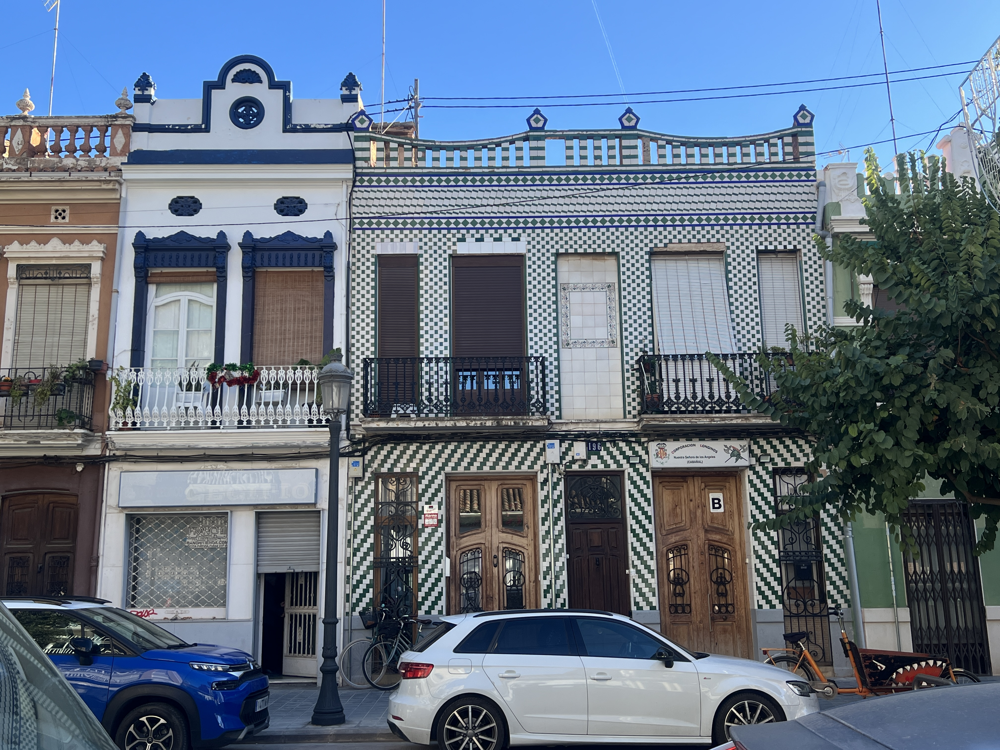{ width="350" loading=lazy}
    /// caption
    Cabanyal city after transformation, Valencia
    ///

-   

    { width="350" loading=lazy}
    /// caption
    Cabanyal colorful architecture after transformation, Valencia
    ///

-   

    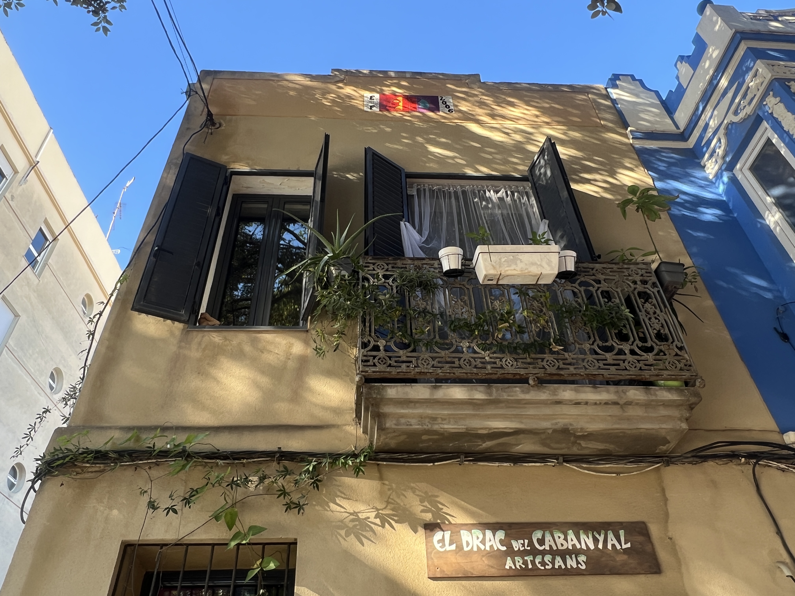{ width="350" loading=lazy}
    /// caption
    Cabanyal colorful architecture after transformation, Valencia
    ///

-   

    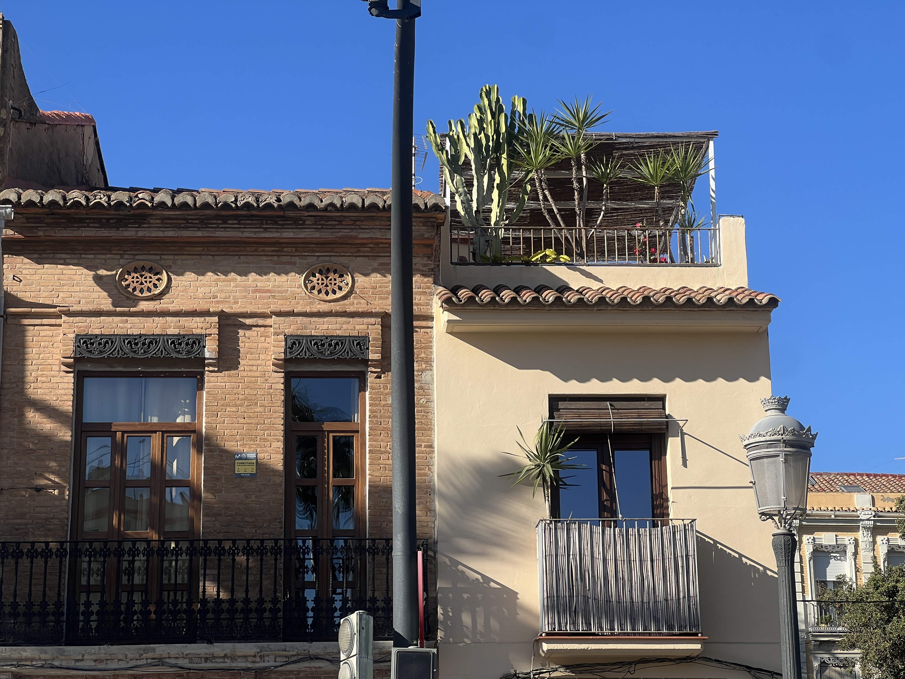{ width="350" loading=lazy}
    /// caption
    Cabanyal balcony tropical plants design, Valencia
    ///

-   Creative designed bookshop in El Carmen, 

    great selections of books📚, 
    
    interesting and amazing presentations of artworks posters, 
    
    cosmic starlights overhead, and déguiséd bookshop staff! 
    
    For more creative educational inspirations like quantum education please check the physicist Nikola [Barcelona Conference talk](https://www.youtube.com/watch?v=hmV1JWdooKY&t=182s) .

-  

    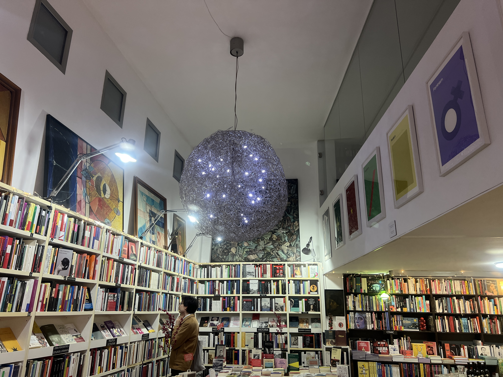{: align=right width="350" loading=lazy}
    /// caption
    Creative designed bookshop, El Carmen
    ///

### 🌌 Institut Valencià d'Art Modern - IVAM

-   

     *España Oculta(Hidden Spain)*, 
     
     Cristina Garcia Rodero started a project that capture the essence of the myriad Spanish traditions, religious practices and rites that were already fading away. The work also captured a key moment in Spain’s history — with Spanish dictator Franco dying in 1975, and the country commencing a period of transition – something that would come to have a huge effect on the way the nation’s cultural traditions and rites were experienced and performed from then on. The photos reflect not only on how much Spain has changed, but how her passion for photographing rituals and traditions around the world has been affected by globalization, and the Internet era.

-   

    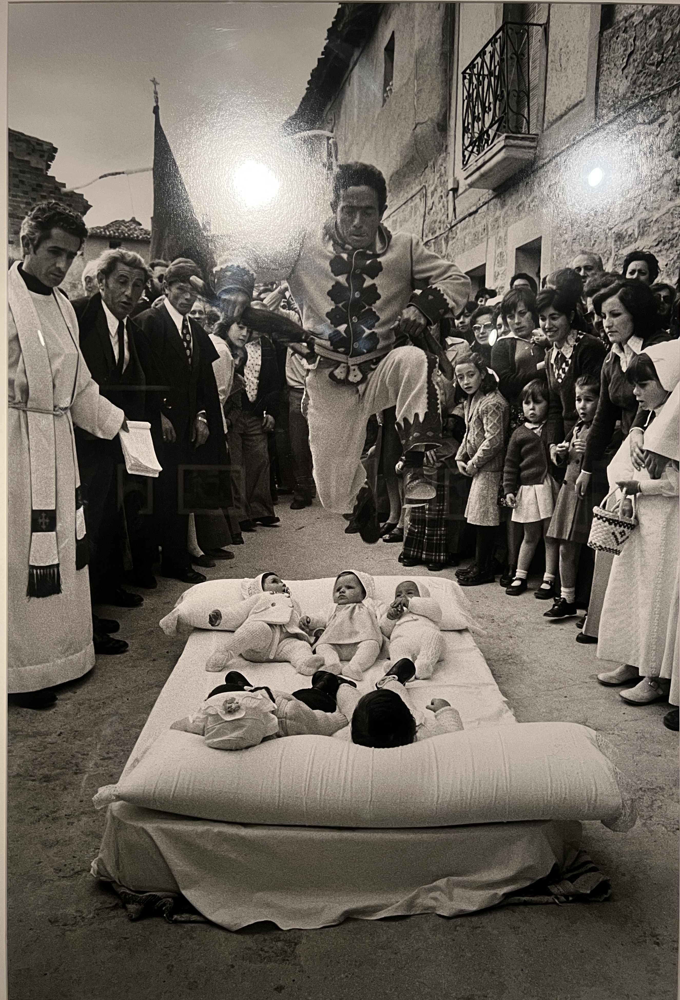{: align=right width="350" loading=lazy}
    /// caption
    España Oculta(Hidden Spain), 1989,  Cristina Garcia Rodero 
    /// 

<!-- IVAM -->

-   

    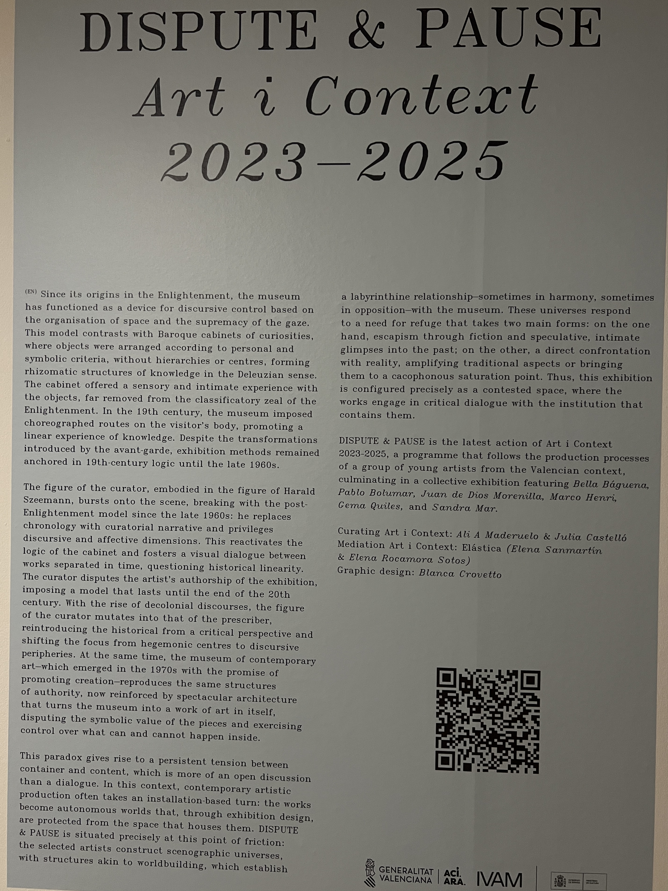{ width="350" loading=lazy}
    /// caption
    Dispute & Pause, temporary exhibition, IVAM, Valencia
    ///

    -   *Dispute & Pause: Art i Context (2023–2025)* at IVAM is a powerful exploration of how art, education, and institutions can think together. Through *D’ací allà*, the exhibition emerges from a collective process involving artists, curators, mediators, and teachers, questioning the relationships between museum and school, archive and action, learning and creation. Interactive installations, archival materials, and a thoughtfully designed booklet invite visitors to slow down, ask questions, and actively engage. Rather than offering fixed narratives, the exhibition breaks the boundries and opens a shared space for reflection and participation—demonstrating how exhibitions can become living, educational experiences shaped with and by their audiences.

-   

    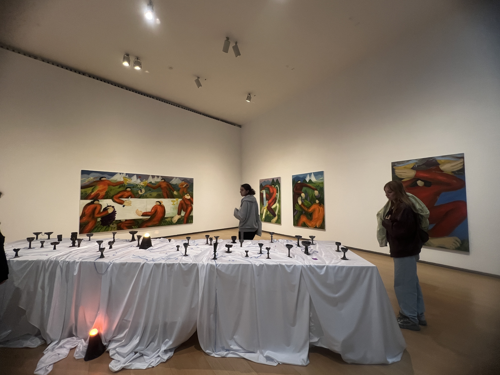{ width="350" loading=lazy}
    /// caption
    Dispute & Pause, temporary exhibition, IVAM
    ///

-   Imagination time:

    Improvise a danse in front of the artworks without moving your feet

####  ☄️ Entre lo profundo y lo distante, Andrea Canepa

-   

    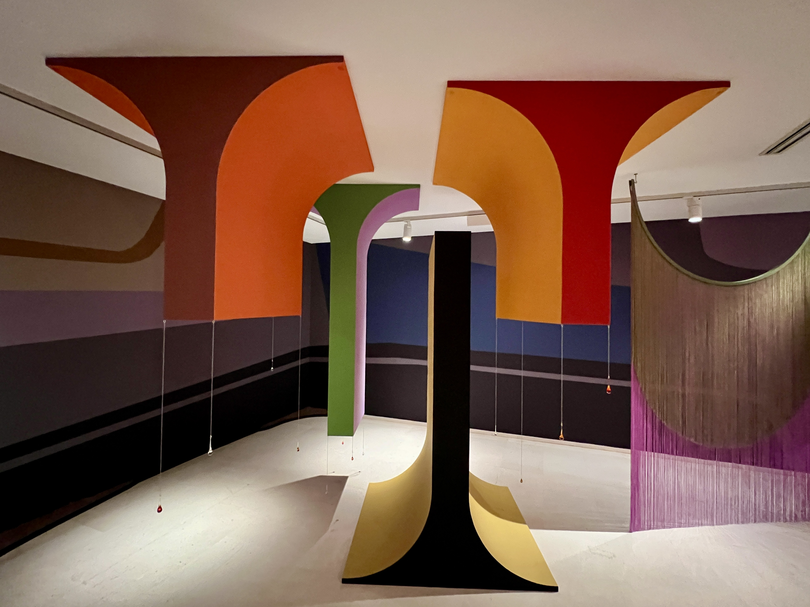{ width="350" loading=lazy}
    /// caption
    Between the Deep and the Distant, IVAM
    ///

-   

    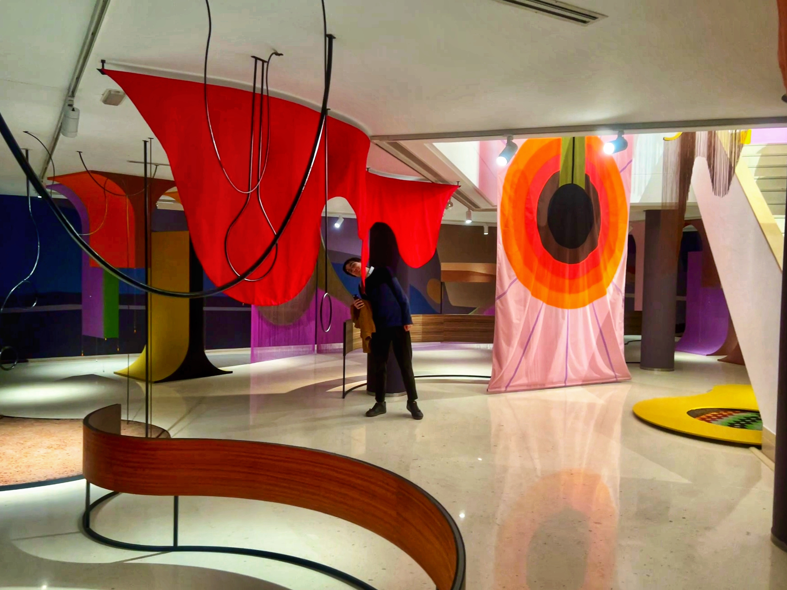{ width="350" loading=lazy}
    /// caption
    Between the Deep and the Distant, IVAM
    ///

{ width="460" loading=lazy}
/// caption
Humourous corner with unhappy Trump on the top , Valencia
///

### 🎊 Sunlight, Books, Hope and New Ways of Seeing

In the midst of a global climate of uncertainty — environmental, political, and moral— the touching part is all the beautiful efforts made by the people of the city in Valencia. 

I saw people defending their city together against floods, even when leadership chose ignorance. 
I saw a collective commitment to preserving artisanal and artistic practices, to nurturing creativity through interactive museums and the explosive imagination of the Fallas festival traditions. I felt it in the warmth of everyday hospitality, in the vibrant community life built for and with the elderly, in the rare absence of rigid boundaries between generations. I saw it in the humble intelligence of agricultural system by leveraging the geographical advantages, in the dignity of hard work, and in the diversity and generosity of the food— each dish carrying memory, care, and place… 

All of this made Valencia feel like a city that refuses despair. A city that answers crisis not with withdrawal, but with imagination, solidarity, and joy.

It brought to mind [Jane Goodall’s](https://en.wikipedia.org/wiki/Jane_Goodall) *["The Book of Hope"](https://us.macmillan.com/books/9781250784094/thebookofhope/)*. She writes openly about moments when the fight for the planet feels unwinnable—when exhaustion and grief are unavoidable. Yet she insists that hope is not naïve optimism, but a practice. [Speaking to the Guardian](https://www.theguardian.com/science/2021/oct/20/jane-goodall-on-fires-floods-frugality-and-the-good-fight-people-have-to-change-from-within), she said: *“You have to feel depressed, but then there’s something that says: there is still an awful lot left—and that’s what we’ve got to fight to save.”*

And then, with quiet defiance: “*So then you get extra energy… I’m not going to give in. I’ll die fighting, that’s for sure.*”

Walking through Valencia, I understood what she meant. Hope is not an abstract idea—it is built daily, by ordinary people, in shared labor, shared culture, shared meals, and shared care. This is what hope looks like when it takes the shape of a city. 🤩

For more discovery of the food, Fallas, culture of this sunny and fantastic city please see [the following article] .

--- Molly, 
>   Small discovery of *" Valencia "* , 
    15/12/2025

[the following article]: https://mollyxmn.gitlab.io/mollyblog/blogs/7/

