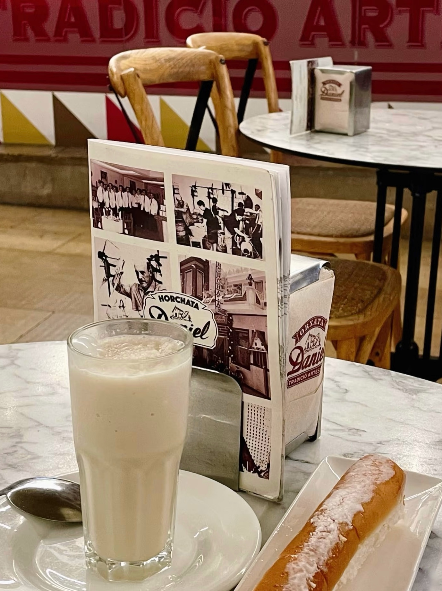
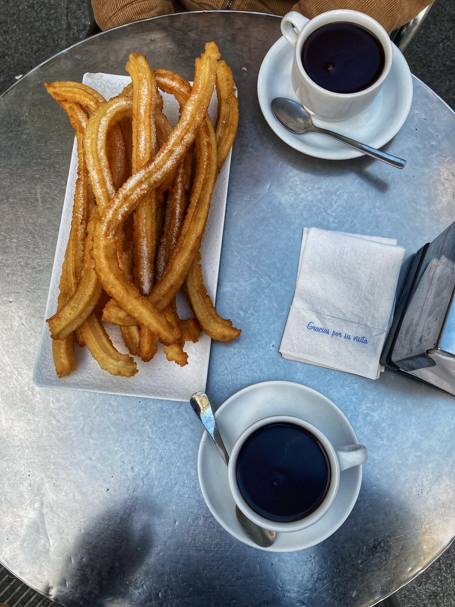
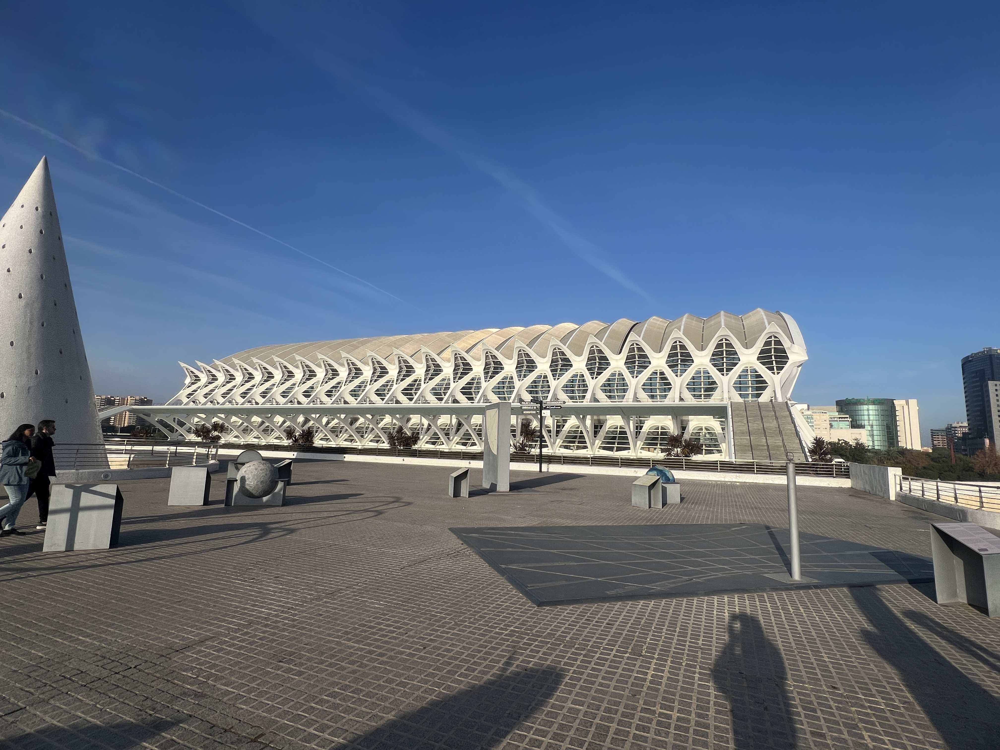
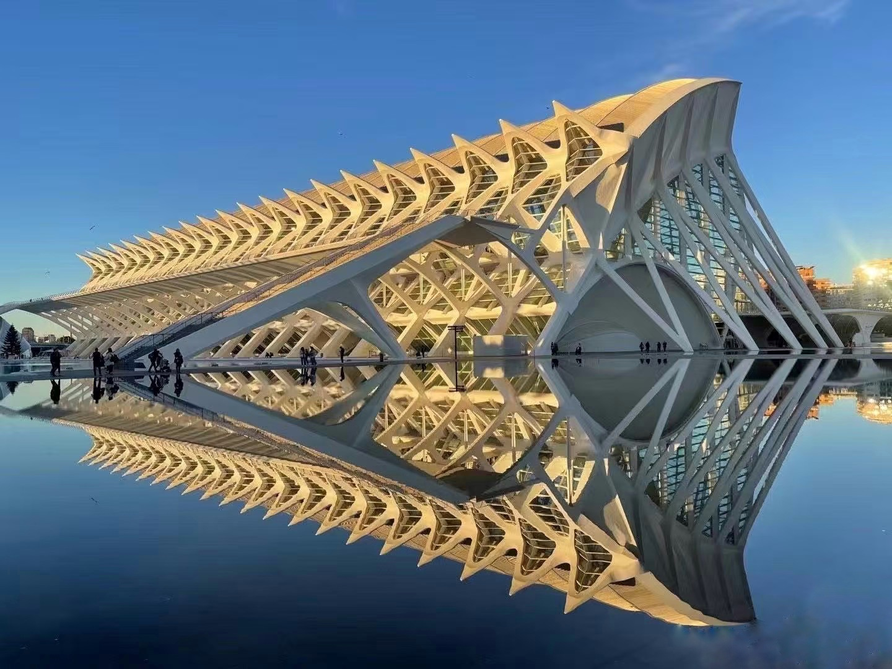

## Under construction... 🥘 

 { align=left width="50" style="border-radius: 50%; overflow: hidden;" loading=lazy}<a class="firstBlog" href='mailto:anothersky080895@gmail.com'>Molly Xue</a>

<!-- more -->
#### 🌍 Fallas & Critism, Valencia

-   Fallero Museum

    Under construction... 🌻

-   

    {: align=left width="350" loading=lazy}
    /// caption 
    Churros with valencian hot chocolate
    ///

-   🌍 La Lonja de la Seda( Valencia's Silk Exchange), Valencia

    Under construction... 🌻
-   

    {: align=left width="350" loading=lazy}
    /// caption 
    ???
    ///

#### Paella, Horchata, Epinadas

-   

    {: align=left width="350" loading=lazy}
    /// caption 
    Churros with valencian hot chocolate
    ///

-   

    {: align=left width="350" loading=lazy}
    /// caption 
    Churros with valencian hot chocolate
    ///

-   🌍 Tribunal de les Aigües de la Vega de València, Valencia (inherited from arabic traditions)

    It is the world’s oldest court and the oldest democratic institution in Europe, the organization which we have inherited dates from times of the Al-Andalus and, very possibly, from times of the Califato (Caliph rulers) of Córdoba, perfected from the first moments of the conquest of the Kingdom of Valencia by the king Don Jaime.
 
    Under construction... 🌻

-   

    {: align=left width="350" loading=lazy}
    /// caption 
    ???
    ///

-   
    { align=left width=350 }
    /// caption
    City of art and science, Santiago Calatrava
    ///
-   
    { align=right width=350 }
    /// caption
    City of art and science, Santiago Calatrava
    ///

{ width="460" loading=lazy}
/// caption
Flamengo, Oceanographic
///