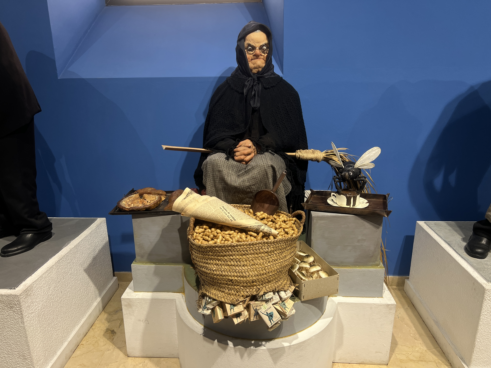
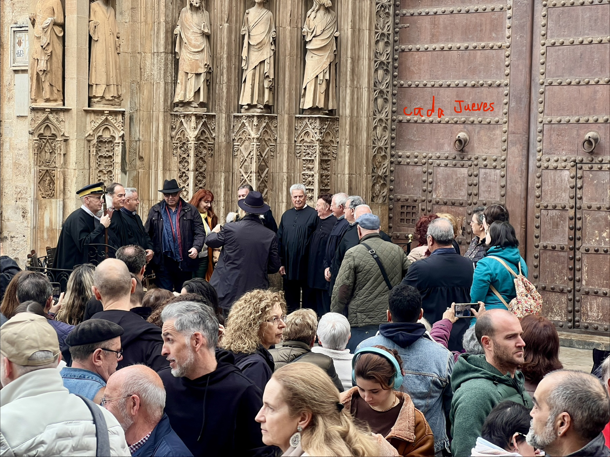

## Under construction... 

!!! danger "“Have an idea? GitHub login → comment below ⬇️ 💬😜” "

 { align=left width="50" style="border-radius: 50%; overflow: hidden;" loading=lazy}<a class="firstBlog" href='mailto:anothersky080895@gmail.com'>Molly Xue</a>

<!-- more -->
#### 🌍 Fallas & Critism, Valencia

-   Create a WWW(World Wide Web).20XX.freedom of thought 🌻

-   

    {: align=left width="350" loading=lazy}
    /// caption 
    Churros with valencian hot chocolate
    ///

-   🌍 Tribunal de les Aigües de la Vega de València, Valencia (inherited from arabic traditions)

    It is the world’s oldest court and the oldest democratic institution in Europe, the organization which we have inherited dates from times of the Al-Andalus and, very possibly, from times of the Califato (Caliph rulers) of Córdoba, perfected from the first moments of the conquest of the Kingdom of Valencia by the king Don Jaime.
 
    Under construction... 🌻

-   

    {: align=left width="350" loading=lazy}
    /// caption 
    ???
    ///

