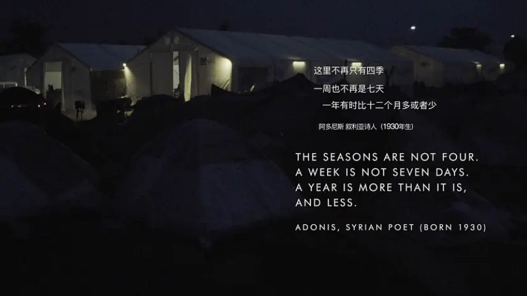
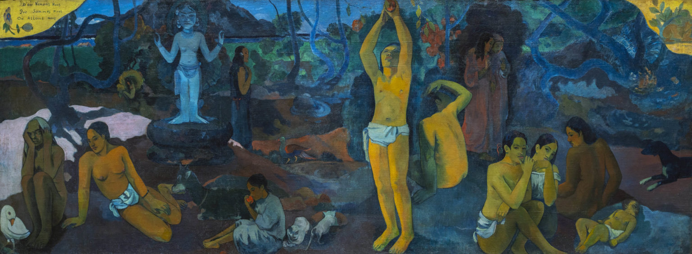

# Summary for the blog 🟠
!!! danger "“Have an idea? GitHub login → [Comment below](#comments) ⬇️ 💬😜” "

 { align=left width="50" style="border-radius: 50%; overflow: hidden;" loading=lazy}<a class="firstBlog" href='mailto:anothersky080895@gmail.com'>Molly Xue</a>

<!-- more -->

Dear Reader,

Another Sky is a space where I share my thoughts and knowledge with anyone who loves to read. It is an honor to have your attention, and I’d love to hear from you—what you enjoy, what you’d like to see more of, and how we can improve. After all, this space exists for you! (Feel free to 
<a href='mailto:anothersky080895@gmail.com'> **send me an email**</a> with your thoughts and ideas! 

This is a place where we explore diverse values and seek the truth -- a journey that takes us through history, where we explore in depth from Mesopotamia, going through the [Silk Road] from Persian to ancient China. Here, we look beyond war, colonialism, and racism to uncover the wisdom and grandeur of civilizations. You can trace your ancestors, whether they were from the ancient Yanomami tribes in the Amazon rainforest or from [Suriname Indigenous communities]. And also discovering how cultures are shaped by [Islam], Christianity, Judaism, Buddhism, Hinduism, Confucianism, Daoism etc. 😜 

Let’s engage in deep conversations with Hannah Arendt on [The Human Condition] and [The Origins of Totalitarianism]. Join [David Graeber] in uncovering human history, society, and civilization through archaeology empirical data. Stand with Mark Fisher in [Capitalist Realism], searching for alternatives. Travel through the Tang Dynasty of China with Bertrand Russell, debate meritocracy and justice with Michael Sandel, and discover The Work of Art in the Age of Mechanical Reproduction with Walter Benjamin, explore [The Century of the Self and the construction of modern identity] with Adam Curtis, doubt [The Abyss of Freedom] with Slavoj Žižek... There’s so much I’m eager to share with you.

<figure markdown="span" >
  { align=left width="800" loading=lazy}
  <figcaption ><a href ='https://www.youtube.com/watch?v=OJsWSa_On9A'>
  “Human Flow”: World-Renowned Artist & Activist Ai Weiwei </a></figcaption>
</figure>

No matter how drastic technological or social transformations may seem, human emotions and experiences remain surprisingly constant. The works of philosophers and historians from centuries past still resonate with us today. Whenever you are, whether you imagine yourself in Song Dynasty China, pre-World War I Vienna, or post-war London, you will find that human joys, sorrows, fears, struggles, aspirations anxieties are deeply interconnected across time. It is this shared experience and continuity that binds and sustains our civilization together. 

Historical awareness is not just a personal pursuit —- it is a lens that more deeply connected with the world around us. Developing historical awareness sharpens our perception of the present, making us more sensitive, insightful, and reassured—reminding us that our experiences, fears, and aspirations are not as unique as we might think. As Wang Fansen once said, "History is the study that expands the heart and mind." 

Let us continue this intellectual journey, using wisdom and knowledge to sustain this connection, to create new possibilities and value, and to infuse imagination into the ordinary. This is why I write this blog—to share my reflections and insights, to explore history’s echoes in our present, and to inspire a deeper understanding of our shared human journey.

Intellect and savoir are weapons that defend against deception and oppression. They keep us awake in the face of falsehoods and open portals to new world, making life more abundant and meaningful. 

This pursuit of understanding need not be confined to a single discipline. We can navigate across dimensions—like a mathematician in the spirit of [Bertrand Russell], see through the [quantum lens] of physicist like [Nikola], trace innovation through the legacy of Alexander Graham Bell -- [Bell Labs], or explore the interconnectedness of [power, sex, and biology] that shapes our universe.

I hope that my personal reflections can become part of history — a continuously unfolding dialogue that opens new doors for others. May we cultivate a heightened sensitivity, transform silence into courage and action, and turn the concrete into the abstract.  

May we always "live elsewhere" (Rimbaud).🌹 
"To live elsewhere — that is the dream, the art, the poetry." 

If, with my limited time and abilities, I can make even a small impact—encouraging more people to join in resistance and change—then every effort is worth it. Together, we can build something greater.

Faithful readers, you know the articles wrote by me take many effort and extra time, so if you like my articles or blog, please you can subscribe to the blog monthly or annually, just click the button below {== Water a seed to flower ==} so that you can help me to grow and in return you get more intellectual flowers 🌺🌺.

🩷 [$$ amount](https://buymeacoffee.com/mollyxue) you'd like for one month.

???+ Note

    How my blog works: every blue highlighted word blocks allows you to access the linked ressources. And all the articles are written in two languages Chinese and English ( you can change it on the top right angle) with a special music to purify your soul:) I can add more languages in the future like Spanish（as i'm learning）, French etc if there's more like 🌹! 
    
    Ps: I also added the comment function at the bottom of some articles if you have some ideas please login to you Github accout to leave the comments 😜

Thank you so much for the gift of your attention!

With appreciation,  
Molly

{ align=left style="margin-bottom: 0%;" loading=lazy} <a class="firstBlog" href='https://www.theguardian.com/artanddesign/2025/mar/17/polynesians-astonishing-revelations-paul-gauguin-syphilis-underage'>

<small>Paul Gauguin, Where do we come from? What are we? Where are we going?,1897–98   click here surprise 😝</small>

[Suriname Indigenous communities]: https://mollyxmn.gitlab.io/mollyBlog/blogs/thirdblog/

[The Abyss of Freedom]: https://nosubject.com/The_Abyss_of_Freedom
[Capitalist Realism]:https://en.wikipedia.org/wiki/Capitalist_Realism
[The Human Condition]:https://en.wikipedia.org/wiki/Human_condition
[The Origins of Totalitarianism]:https://en.wikipedia.org/wiki/The_Origins_of_Totalitarianism
[Silk Road]:https://en.wikipedia.org/wiki/The_Silk_Roads
[David Graeber]:https://en.wikipedia.org/wiki/Debt:_The_First_5,000_Years
[Islam]:https://en.wikipedia.org/wiki/Muqaddimah
[The Century of the Self and the construction of modern identity]: https://press.umich.edu/Books/T/The-Abyss-of-Freedom-Ages-of-the-World

[Bertrand Russell]:https://plato.stanford.edu/entries/russell/
[quantum lens]:https://www.youtube.com/watch?v=9k5nbzNMNGc
[Nikola]:https://iopscience.iop.org/book/mono/978-0-7503-2628-5
[Bell Labs]:https://en.wikipedia.org/wiki/Bell_Labs
[power, sex, and biology]:https://nick-lane.net/books/power-sex-suicide-mitochondria-meaning-life/

