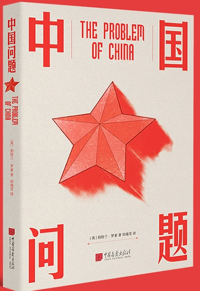

---
date:
  created: 2025-03-15
categories:
  - General
tags:
  - Bertrand Russell
  - China
description: >
  读罗素《中国问题》有感
title: 中国问题 
---

# 中国问题！
 { align=left width="50" style="border-radius: 50%; overflow: hidden;" loading=lazy}<a class="firstBlog" href='mailto:anothersky080895@gmail.com'>Molly Xue</a>

<figure markdown="span">
  { align=left width="300" loading=lazy}
  <figcaption>The Problem of China -- Bertrand Russell</figcaption>
</figure>

<!-- more -->

---
简要: 读罗素《中国问题》有感
---
当我读到罗素先生的《中国问题》的时候，我时常觉得，我们到底是多么不了解自己的国家，同时也被罗素先生在一战和二战之前就对中国、亚洲（中华文化）有这样深刻的见解所折服。他的文字犹如一面镜子，既反映出中国的优点，也揭示了我们容易忽视的问题。18岁出国之后，我发现西方国家对日本有一种谜一样的崇拜。这种崇拜常常让我匪夷所思，因为很多东西明明源自中国文化，却在西方的语境中变成了所谓的“日本先进文化”。

我们不得不肯定日本在文化输出方面的成功。即便这些被广为称赞的“文化”很多都可以追溯到唐朝甚至更早的中国，通过史料完全可以验证其源头。但令人遗憾的是，鲜有人去深究这些文化表面之下的真实来源。或者说，这些历史真相被一些自以为是的“专家”刻意颠倒。许多人只看到日本文化表面的精致华美，被资本主义所塑造的消费文化所驱动，因而轻信资本主义定义的“先进文化”。这种建立在某些殖民逻辑和历史虚构基础上的优越感，使人们对其他文化产生误解或轻视。

然而，从另一个角度看，中国自身的问题也不容忽视。由于各种西方殖民战争，中国未能在早期建立一套像日本那样完备、细致的文化输出体系。近年来，随着经济实力的提升，中国的文化体系也得到了极大的发展，但显然仍有很大的提升空间。

近年来，我越发感受到西方国家这种“无脑式”崇拜的加剧，这背后不仅是对历史的忽视，也反映出一种对文化起源的无知。

而罗素先生作为一个来自西方世界的人，他清醒的看到了欧洲人崇尚暴力、恃强凌弱和歧视有色人种的性格缺陷，批判了美国人的伪道德，并且领悟到“所有的政治都是由咧嘴而笑的恶魔造成的，他教唆那些精力旺盛、头脑灵活的人去折磨那些逆来顺受的广大民众，以夺走他们兜中的钱财、手中的权力和脑中的思想”。从事实出发，他没有偏袒任何一方。

看得出来，罗素先生对中国人民是怀有最大的善意和美好感情的，除了对道家文化的仰慕之情，罗素在中国经历的日子也使他感到“中国人待我不薄”。在他看来，中国人天生宽容友爱，以礼待人，追求和平与自由，且拥有参透几千年人生归宿的大智慧，但也正是中国人的善良、淡泊和长期不重视科技与效率的传统，导致它在与西方的碰撞中滑向另一个极端——为列强的坚船利炮所破。相比之下，欧美人颐指气使的狂妄自信则会带来更大的负面效果，二者如能调和，地球上会比现在有更多的欢乐祥和。

 
 31/01/2025